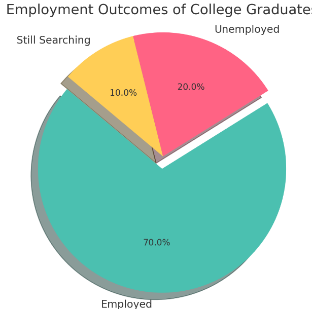

## Topic: **The problem of unemployed college graduates**

### Why is this topic important?
College graduates’ unemployment is especially troubling because it affects them in the wrong way – by wasting education and future work opportunities. Additionally, unemployment levels that are too high are more damaging to the economy at large, leading to social inequality, mental health problems and slowed growth.

## An answer will look like:

## Three Data Sources
- URL(FILE): https://www.kaggle.com/datasets/pantanjali/unemployment-dataset
- URL(FILE): https://fred.stlouisfed.org/series/CGBD2024
- URL(API): https://www.bls.gov/developers/home.htm

In order to properly represent the issue of college graduates who don’t have jobs, the following variables from these datasets can be mapped:

**Unemployment Dataset**: This dataset has unemployment statistics for different demographic groups, such as education. Several variables of interest in integrating could be:
- Year
- State or Region
- Degree Levels (e.g., Bachelor Degree)

**Federal Reserve Economic Data (FRED)**: This dataset tracks economic indicators like the labor market. The relevant variables to merge could be:
- Year
- State or Region
- Rate Of Labour Force %

**BLS API**: The BLS API gives a wide range of labor market statistics, such as:
- Year
- Industry
- Geographic Region (State, MSA)

### Proposed Merging Strategy

Combining these datasets based on the related variables of Year and State or Region can give you insights into how college-graduate unemployment compares with other economic metrics and patterns. This collaboration will help further study the effect of education level on jobs and the way this works across regions and time.
